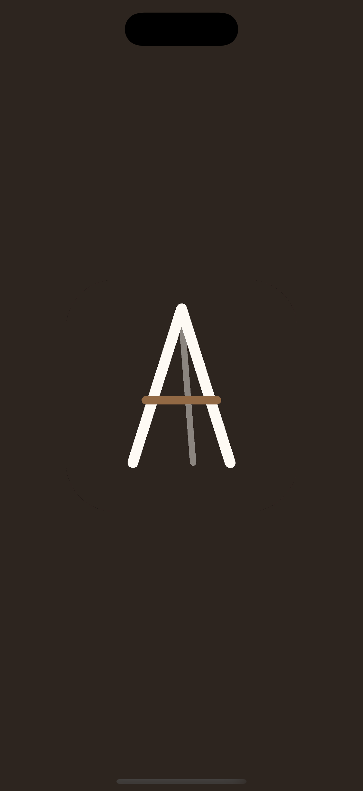
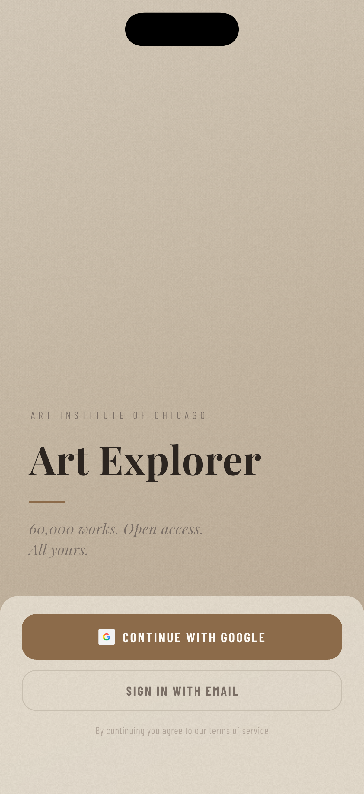
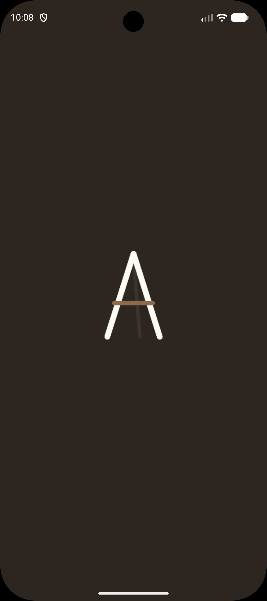
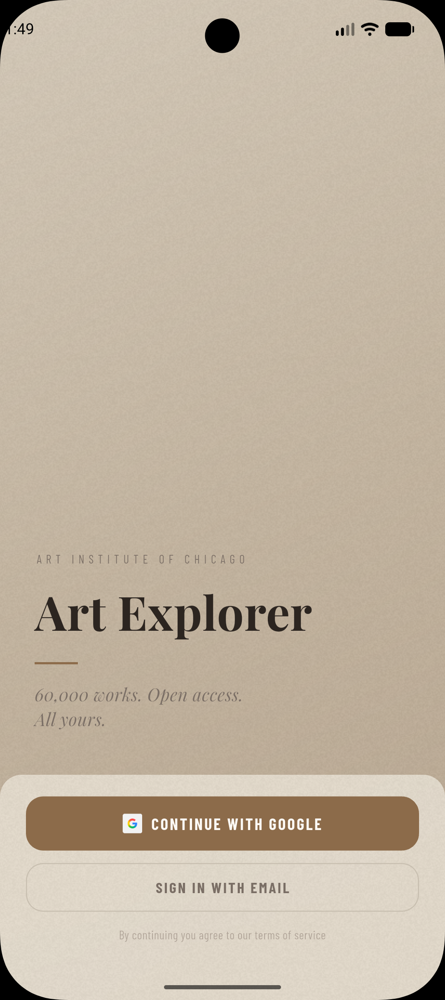

# Art Explorer

A Flutter app for browsing the Art Institute of Chicago's public collection — browse and search thousands of artworks and save favourites to a personal collection that syncs across devices.

*Early work in progress — the roadmap below reflects current state. Built in public.*

## Screenshots

| | Splash | Auth Screen |
|---|:---:|:---:|
| **iOS** |  |  |
| **Android** |  |  |

## Tech Stack

| Layer | Choice | Notes |
|---|---|---|
| Language | Dart / Flutter | iOS & Android |
| State management | BLoC | One bloc per domain — `AuthBloc`, `ArtworkBloc`, `CollectionBloc` |
| Data source | AIC Public API (REST) | CC0, no API key required |
| Auth | Firebase Auth · Google Sign-In | Email/password and Google Sign-In |

## Architecture

Strict BLoC + Repository — no business logic in the UI layer. Each bloc owns one domain and emits states the UI rebuilds from; repositories own all API and Firestore access.

```
UI (screens / widgets)
  ↓  events
BLoC          AuthBloc · ArtworkBloc · CollectionBloc
  ↓  calls
Repository    ArtRepository (AIC API) · AuthRepository (Firebase) · CollectionRepository (Firestore)
  ↓
Models        plain Dart data classes (Artwork)
```

Project layout (committed state — UI layer in progress):

```
lib/
├── main.dart
├── app.dart                       # MaterialApp
├── firebase_options.dart          # generated by flutterfire configure — not committed, see Firebase Setup
├── blocs/
│   ├── auth/                      # AuthBloc — events / states
│   ├── artwork/                   # ArtworkBloc — fetch, filter, search, pagination
│   └── collection/                # CollectionBloc — load, save, remove, clear
├── models/
│   └── artwork.dart               # fromMap / toMap / imageUrl
├── repositories/
│   ├── art_repository.dart        # AIC API — browse, style filter, search
│   ├── auth_repository.dart       # Firebase Auth
│   └── collection_repository.dart # Firestore — load, save, remove
├── screens/
│   ├── auth_screen.dart           # wired to AuthBloc — email sign-up fallback still pending
│   └── browse_screen.dart         # stub — title only
├── theme/
│   ├── app_colors.dart            # color tokens
│   ├── app_text_styles.dart       # Playfair Display / Barlow Condensed text styles
│   └── app_theme.dart             # ThemeData
├── utils/
│   └── app_strings.dart
└── widgets/
    └── linen_panel.dart           # signature frosted-linen panel — used on Auth, Browse, Detail
```

## Roadmap

- [x] `Artwork` model — JSON parsing and an `imageUrl` getter for the AIC IIIF endpoint
- [x] `ArtRepository` — paginated browse, style filter, and search against the AIC API
- [x] `ArtworkBloc` — fetch, filter, search, and pagination (rolls back on a failed page load)
- [x] Firebase Auth — `AuthRepository` + `AuthBloc` (email/password and Google Sign-In)
- [x] `CollectionRepository` + `CollectionBloc`
- [ ] Browse screen
- [x] Auth screen UI — landing state (wordmark, Google Sign-In and email buttons)
- [ ] Auth screen wired to `AuthBloc` (`SignInWithGoogle`, `SignInWithEmail` events) — 🚧 In progress
- [ ] Collection screen
- [ ] Detail screen — save/unsave wired to Firestore
- [ ] Search screen
- [ ] Polish — transitions, empty states, error states, loading skeletons
- [ ] Tests (`bloc_test`)

## Getting Started

### Prerequisites

- Flutter 3.x / Dart 3.x
- VS Code with the [Flutter extension](https://marketplace.visualstudio.com/items?itemName=Dart-Code.flutter)
- Android SDK via Android Studio (emulator / device builds)
- Xcode (macOS only — required for iOS simulator and device builds)
- A Firebase project (config files are not committed — see below)

### Firebase setup

1. Create a Firebase project at [console.firebase.google.com](https://console.firebase.google.com)
2. Enable **Email/Password** and **Google Sign-In** under Authentication
3. Enable **Firestore**
4. Run `flutterfire configure` to generate `lib/firebase_options.dart`
5. Download `google-services.json` from the Firebase console and place it in `android/app/`
6. Download `GoogleService-Info.plist` from the Firebase console and place it in `ios/Runner/`
7. For Google Sign-In on Android: add the SHA-1 fingerprint to your Android app in the Firebase console

### Clone & run

```bash
git clone https://github.com/eomapps/artexplorer_flutter.git
cd artexplorer_flutter
flutter pub get
flutter run
```

## License

Artwork data and images are provided by the Art Institute of Chicago under CC0 via their public API.
