# Art Explorer

A Flutter app for browsing the Art Institute of Chicago's public collection — browse thousands of artworks and save favourites to a personal collection that syncs across devices.

*Built in public as a portfolio piece, demonstrating BLoC, REST APIs, Firebase Auth, and Firestore.*

## Screenshots

| | Browse | Detail | Saved | Collection |
|---|:---:|:---:|:---:|:---:|
| **iOS** | 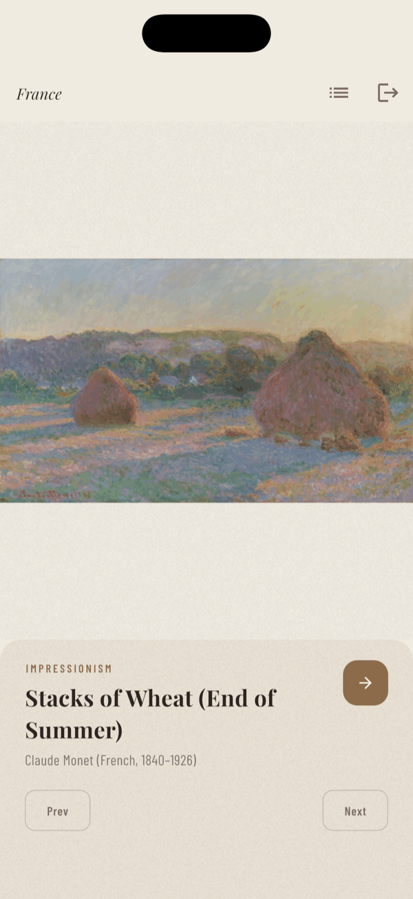 | 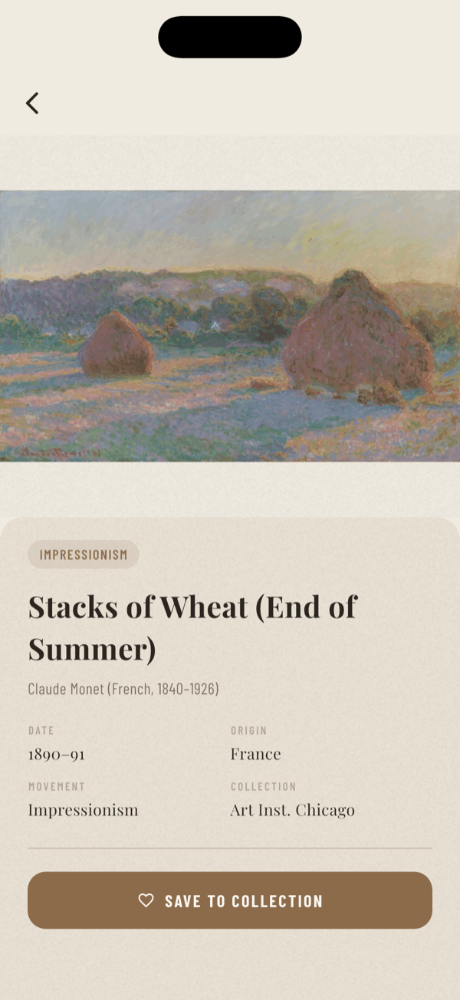 | 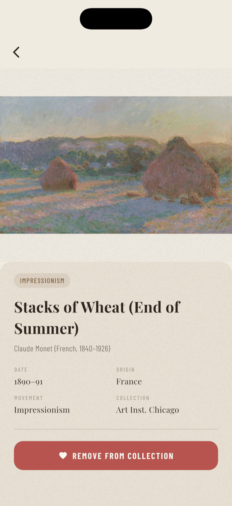 | 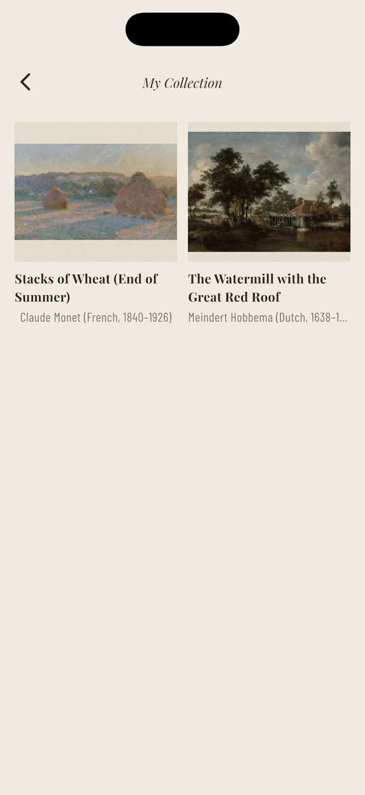 |
| **Android** | 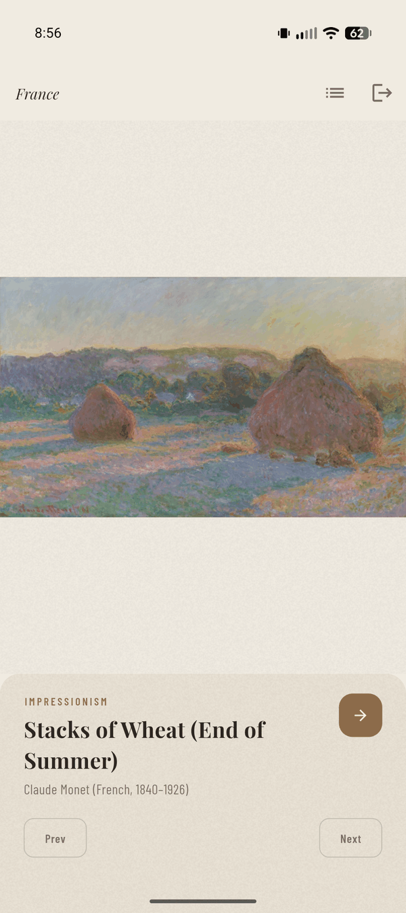 | 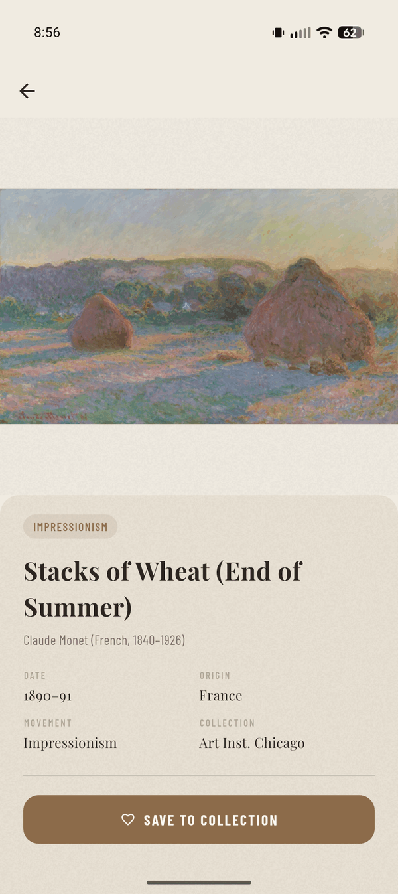 | 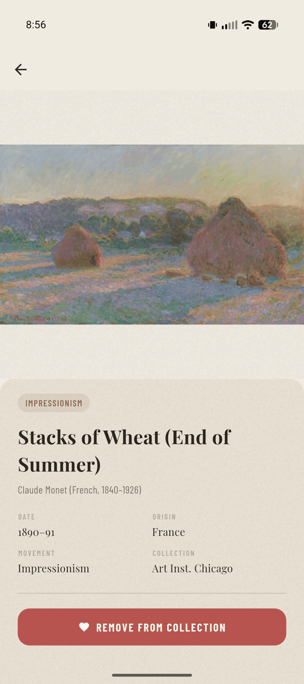 | 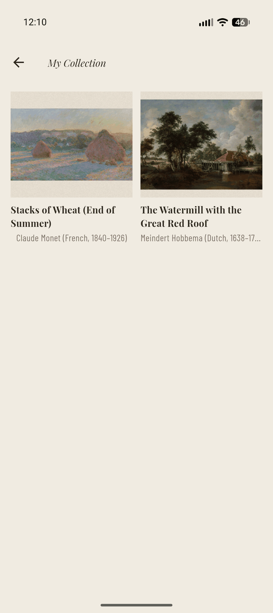 |

<sub>The auth flow below is captured on both platforms.</sub>

| | Splash | Sign In |
|---|:---:|:---:|
| **iOS** |  | 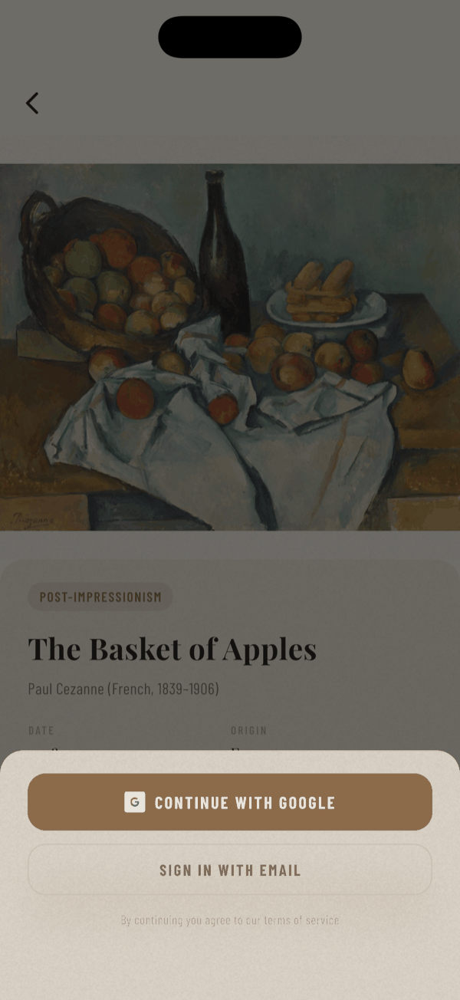 |
| **Android** | 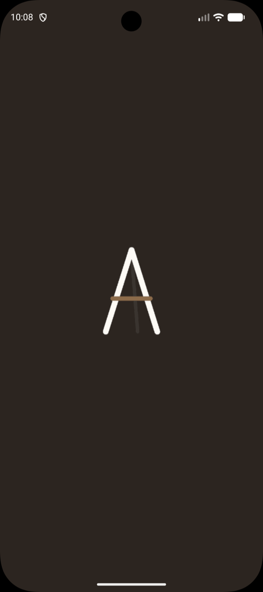 | 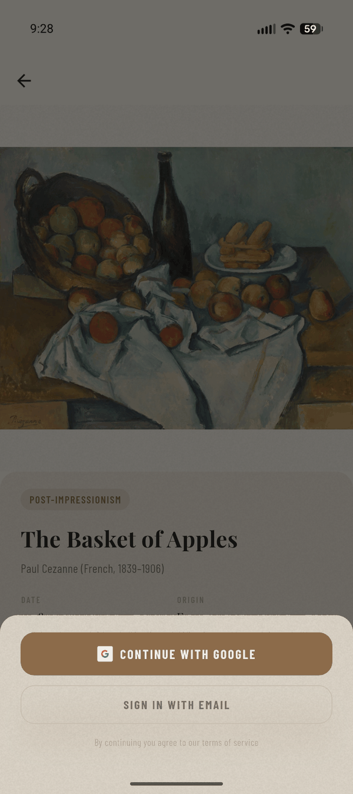 |

## Tech Stack

| Layer | Choice | Notes |
|---|---|---|
| Language | Dart / Flutter | iOS & Android |
| State management | BLoC | One bloc per domain — `AuthBloc`, `ArtworkBloc`, `CollectionBloc` |
| Data source | AIC Public API (REST) | CC0, no API key required — requests send an `AIC-User-Agent` header identifying the app, per AIC's guidance, to avoid Cloudflare rate-limiting |
| Auth | Firebase Auth · Google Sign-In | Email/password and Google Sign-In |
| Database | Firestore | Per-user saved collections, cross-device sync — locked down by `firestore.rules` |

## Architecture

Strict BLoC + Repository — no business logic in the UI layer. Each bloc owns one domain and emits states the UI rebuilds from; repositories own all API and Firestore access.

```
UI (screens / widgets)
  ↓  events
BLoC          AuthBloc · ArtworkBloc · CollectionBloc
  ↓  calls
Repository    ArtRepository (AIC API) · AuthRepository (Firebase) · CollectionRepository (Firestore)
  ↓
Models        plain Dart data classes (Artwork)
```

`CollectionBloc` also subscribes directly to `AuthBloc`'s state stream — it auto-fires `LoadCollection` on sign-in and `ClearCollection` on sign-out, independent of any UI action.

The app launches straight into Browse with no forced auth wall. Tapping Save while signed out opens a modal `AuthBottomSheet` over the current screen; on successful sign-in the sheet dismisses and the save completes automatically.

Firestore access is restricted via `firestore.rules`, committed at the repo root: each user can only read/write their own `users/{uid}/savedArtworks` subcollection.

Project layout:

```
lib/
├── main.dart
├── app.dart                        # MaterialApp, BlocProviders, auth-state routing
├── firebase_options.dart           # generated by flutterfire configure — see Firebase Setup
├── blocs/
│   ├── auth/                       # AuthBloc — events / states
│   ├── artwork/                    # ArtworkBloc — fetch, filter, pagination
│   └── collection/                 # CollectionBloc — load, save, remove, clear
├── models/
│   └── artwork.dart                # fromMap / toMap / imageUrl
├── repositories/
│   ├── art_repository.dart         # AIC API — browse
│   ├── auth_repository.dart        # Firebase Auth
│   └── collection_repository.dart  # Firestore — load, save, remove
├── screens/
│   ├── browse_screen.dart          # full-bleed artwork cards, style filters, pagination
│   ├── detail_screen.dart          # full-bleed image, metadata, save/unsave
│   └── collection_screen.dart      # grid of saved artworks
├── theme/
│   ├── app_colors.dart             # color tokens
│   ├── app_text_styles.dart        # Playfair Display / Barlow Condensed text styles
│   └── app_theme.dart              # ThemeData
├── utils/
│   └── app_strings.dart
└── widgets/
    ├── linen_panel.dart            # signature frosted-linen panel — used on Browse and Detail
    ├── artwork_card.dart           # full-bleed card for Browse
    ├── artwork_thumbnail.dart      # thumbnail for Collection grid
    └── auth_bottom_sheet.dart      # sign-in/sign-up modal, triggered by an unauthenticated save
```

## Roadmap

- [x] `Artwork` model — JSON parsing and an `imageUrl` getter for the AIC IIIF endpoint
- [x] `ArtRepository` — paginated browse against the AIC API
- [x] `ArtworkBloc` — fetch, style filtering, and pagination
- [x] Firebase Auth — `AuthRepository` + `AuthBloc` (email/password and Google Sign-In)
- [x] `CollectionRepository` + `CollectionBloc` — reacts to `AuthBloc` sign-in/sign-out
- [x] Browse screen — full-bleed cards, style filter chips, pagination on scroll
- [x] Detail screen — save/unsave wired to Firestore
- [x] Collection screen — grid of saved artworks, empty state
- [x] Unauthenticated-save flow — modal `AuthBottomSheet`, auto-completes the save post sign-in
- [x] Polish — empty states, error states
- [ ] Tests (`bloc_test`)
- [ ] CI (`flutter analyze` + `flutter test`)

## Getting Started

### Prerequisites

- Flutter 3.x / Dart 3.x
- VS Code with the [Flutter extension](https://marketplace.visualstudio.com/items?itemName=Dart-Code.flutter)
- Android SDK via Android Studio (emulator / device builds)
- Xcode (macOS only — required for iOS simulator and device builds)
- A Firebase project (config files are not committed — see below)

### Firebase setup

1. Create a Firebase project at [console.firebase.google.com](https://console.firebase.google.com)
2. Enable **Email/Password** and **Google Sign-In** under Authentication
3. Enable **Firestore**
4. Run `flutterfire configure` to generate `lib/firebase_options.dart`
5. Download `google-services.json` from the Firebase console and place it in `android/app/`
6. Download `GoogleService-Info.plist` from the Firebase console and place it in `ios/Runner/`
7. For Google Sign-In on Android: add the SHA-1 fingerprint to your Android app in the Firebase console
8. Deploy `firestore.rules` (`firebase deploy --only firestore:rules`) so saved collections are locked to their owner

### Clone & run

```bash
git clone https://github.com/eomapps/artexplorer_flutter.git
cd artexplorer_flutter
flutter pub get
flutter run
```

## License

Artwork data and images are provided by the Art Institute of Chicago under CC0 via their public API. Screenshots in this README are limited to artworks with `is_public_domain=true`, so they carry no separate rights restrictions.
